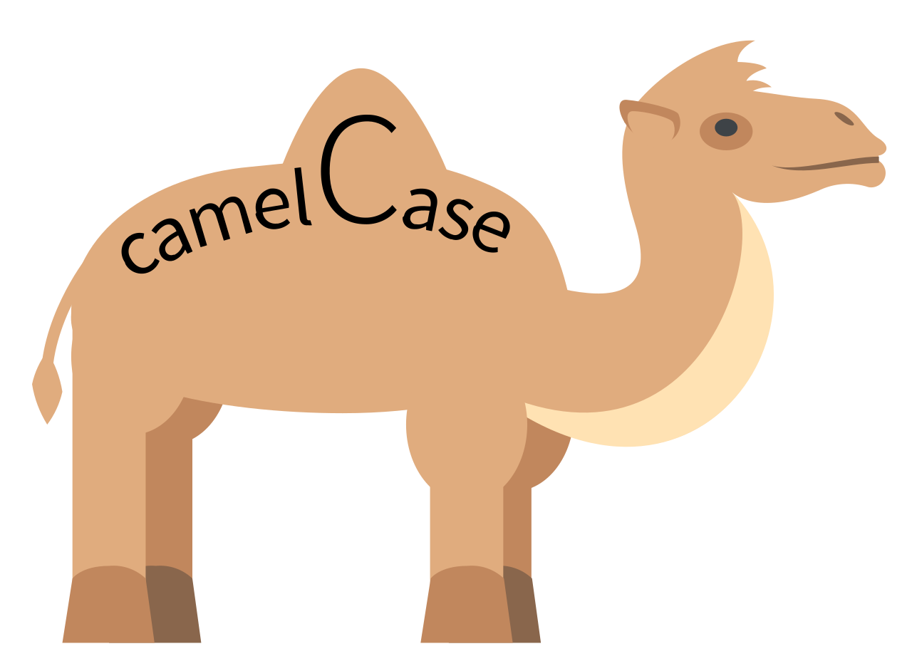

## Internationalisation du panel admin

Les fichiers sont lu automatiquement par CMW. Pour y accéder, il suffit d’utiliser la classe **LangManager**, 
via la méthode translate.

**translate** prend trois paramètres :

- `valueToTranslate` la valeur à traduire, qui se construit par : `nomPackage.sousCategorie.nomObjet`
- `variables` Liste de variable à modifier, positionner obligatoirement entre des pourcentages `%`. ***optionnel***
- `lineBreak` Ajoute la balise `<br>` pour sauter une ligne. ***optionnel***

### Exemple

Nous allons créer un fichier de langue français pour le package "Example". Il faudra donc créer ce fichier en suivant 
cette architecture: **App/Package/Example/Lang/fr.php**

Ici, le fichier s’appelle fr.php, donc CMW comprendra que le fichier de langue sera pour la langue **Française.**

Voici la liste des langues supportées actuellement :

- Français
- Anglais

Voici un exemple de fichier lang:

```php
return [
    "helloBuddy" => "Bonjour ! Je suis une phrase normale",
    "alt" => [
	    "welcome" => "Bienvenue sur CraftMyWebsite 2.0"
    ],
	"variables" => "Des variables ? Alors, euh %name%, est ton prénom ?"
];
```

Les clés ne doivent pas comporter ni d’accents ni de caractères spéciaux ni espaces. Il est important de suivre les 
conventions du CMS pour garantir une bonne maintenabilité dans le temps. Les clés doivent suivre les conventions **camelCase**


## Utiliser les traductions

Cet exemple nous montre, comment accéder à une traduction simple.
**Attention**, il faut toujours commencer par le nom du package, dans notre cas, c'est "example".
```php
use CMW\Manager\Lang\LangManager; //Namespace à importer

echo LangManager::translate("example.alt.welcome");
// Retourne: Bienvenue sur CraftMyWebsite 2.0
```

Cet exemple nous montre, comment accéder à une traduction et utiliser une variable. 
**Attention**, vous ne devez pas écrire les `%` autour de la variable.
Vous pouvez bien évidement utiliser plusieurs variables dans la même traduction.
```php
use CMW\Manager\Lang\LangManager; //Namespace à importer

LangManager::translate("example.variables", ['name' => 'Thomas']);
// Retourne: Des variables ? Alors, euh Thomas, est ton prénom ?
```